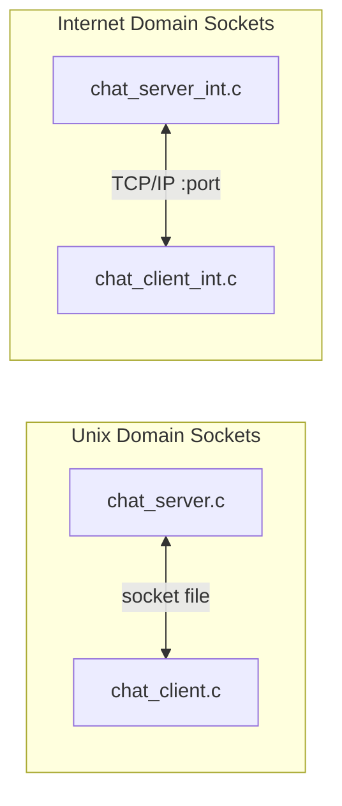
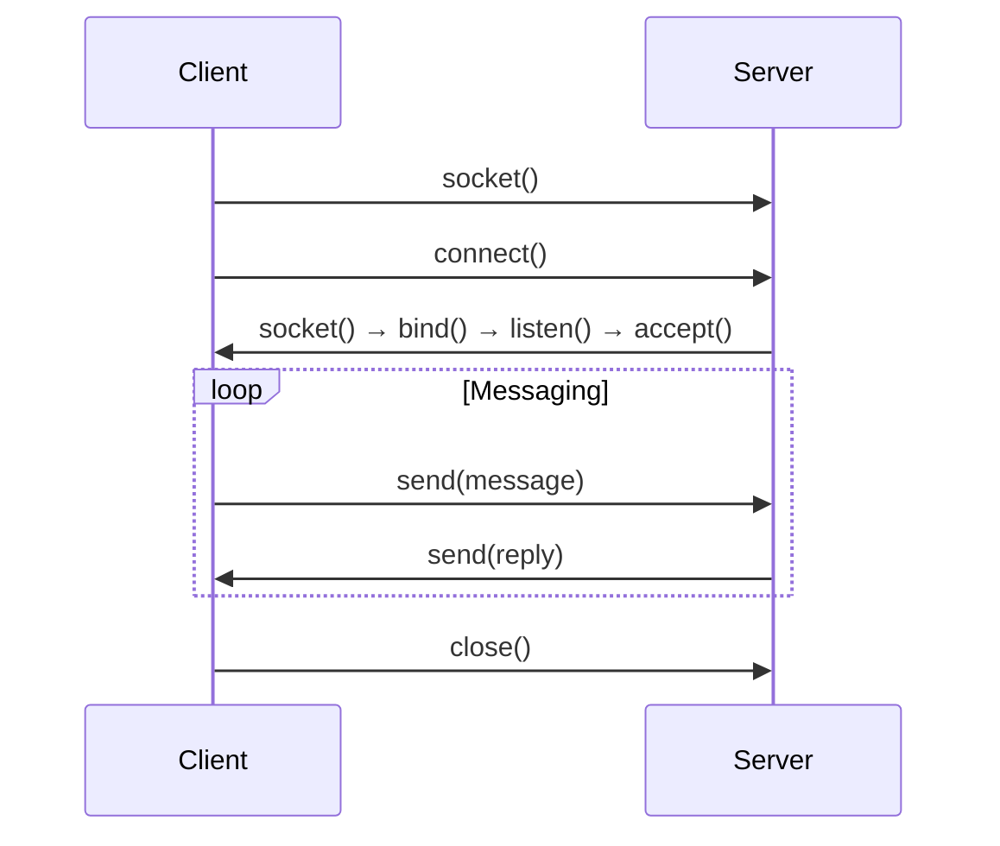

# Chat Application — Unix & Internet Domain Sockets


A dual-mode chat application demonstrating inter-process communication via Unix domain sockets (local) and Internet domain sockets (networked).

## Stack

- C (POSIX sockets API)
- Unix Domain Sockets — local IPC
- Internet Domain Sockets (TCP) — remote communication

## How it works

The system provides two independent chat implementations:



**Unix Domain Sockets** (`chat_server.c` / `chat_client.c`) — communicate between processes on the same machine using socket files. Zero network overhead.

**Internet Domain Sockets** (`chat_server_int.c` / `chat_client_int.c`) — communicate between machines over TCP/IP. The server binds to a port and accepts remote client connections.

Both implementations follow a client-server model with bidirectional message exchange.



## Key features

- Two socket domains (Unix + Internet) in a single project
- POSIX-compliant socket programming
- Bidirectional client-server communication
- No external dependencies — pure C standard library + POSIX

## What this demonstrates

- Socket programming fundamentals (socket, bind, listen, accept, connect)
- Unix vs Internet domain socket differences
- TCP stream communication
- Low-level systems programming in C

## Build and run

```bash
# Unix domain
gcc chat_server.c -o chat_server && ./chat_server
gcc chat_client.c -o chat_client && ./chat_client

# Internet domain
gcc chat_server_int.c -o chat_server_int && ./chat_server_int
gcc chat_client_int.c -o chat_client_int && ./chat_client_int
```
